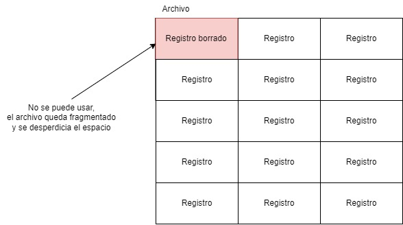
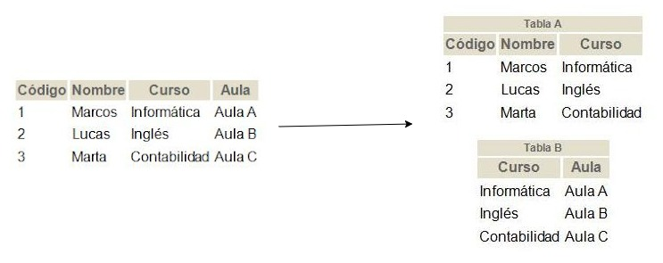
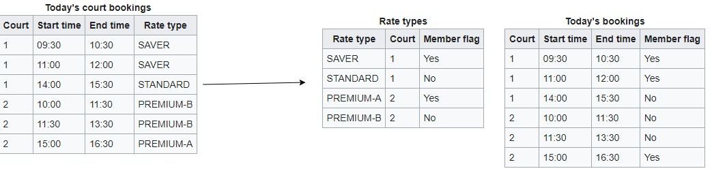
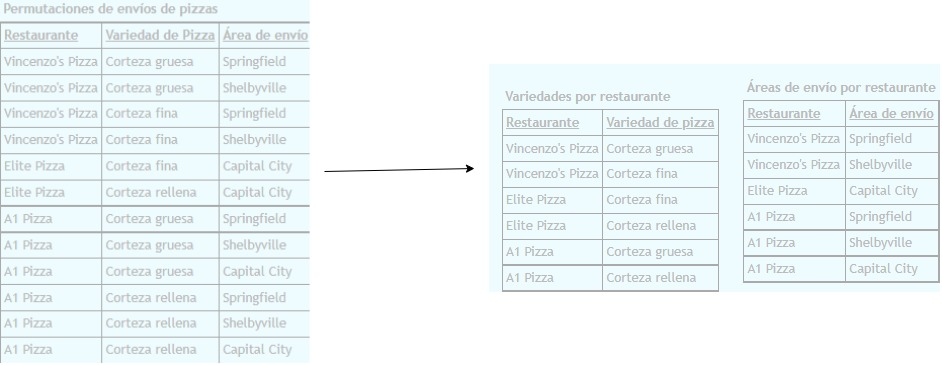

> Bases de Datos 2, Apuntes  

La estructura de información permite integridad, no repetición de datos y consistencia de datos.

Registro -> struct en Pascal, C y C++.

Archivos de acceso aleatorio: brincan en la memoria.

Arvhicos de acceso secuencial: se mueven línea por línea.

Un **Inode** tiene file descriptors. Estos organizan los archivos en un árbol de archivos en el cual cada nodo tiene un puntero de 4 bytes que apunta al archivo. 

El archivo dump apunta a un archivo y tiene un offset hacia ese archivo.

En un registro, tienen un campo especial que tiene el tamaño. El tamaño tiene que ser constante.

Cuando un registro se crea sin algún valor en un campo, se le pone un valor nulo que se representa con 0 o -1 en el archivo que guarda la información.

**Sparse**: si no hay un valor en el campo, no usa el almacenamiento del campo. Se ocupa saber el tamaño de la tupla, por lo que ocupa más CPU para saber cuanta lectura ocupa hacer.

El **almacenamiento a nivel del sistema de tablas** optimiza la información para la lectura. Usa un almacenamiento comunal de manera que crea archivos para cada campo. Son difíciles ya que ocupan abrir diferentes archivos por cada campo que se necesite. Se crea un puntero por cada archivo por lo que utiliza más memoria a cambio de ser más rápido. Los archivos con todos los campos puede que necesiten recorrer otros campos antes de llegar al campo que se quiere leer. Estos archivos solo tienen un puntero. 

**Tercera Forma Normal**: todos los campos de una tabla deben tener relación directa con la llave primaria. Se crea una tabla con las dependencias y una llave primaria que la tabla principal tiene. 

**Boyce Codd Normal Form**: la tabla debe estar en tercera forma normal y no debe tener dependencias parciales entre sus campos, por lo que se forma una llave compuesta. Ocupa abrir más tablas, por lo que es más lenta.

**Cuarta Forma Normal**: hay relación entre los campos de la tabla. Se crean tablas separando los campos que no tienen relación.

